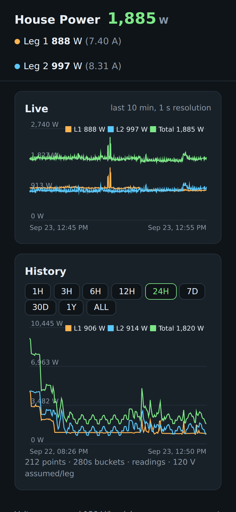
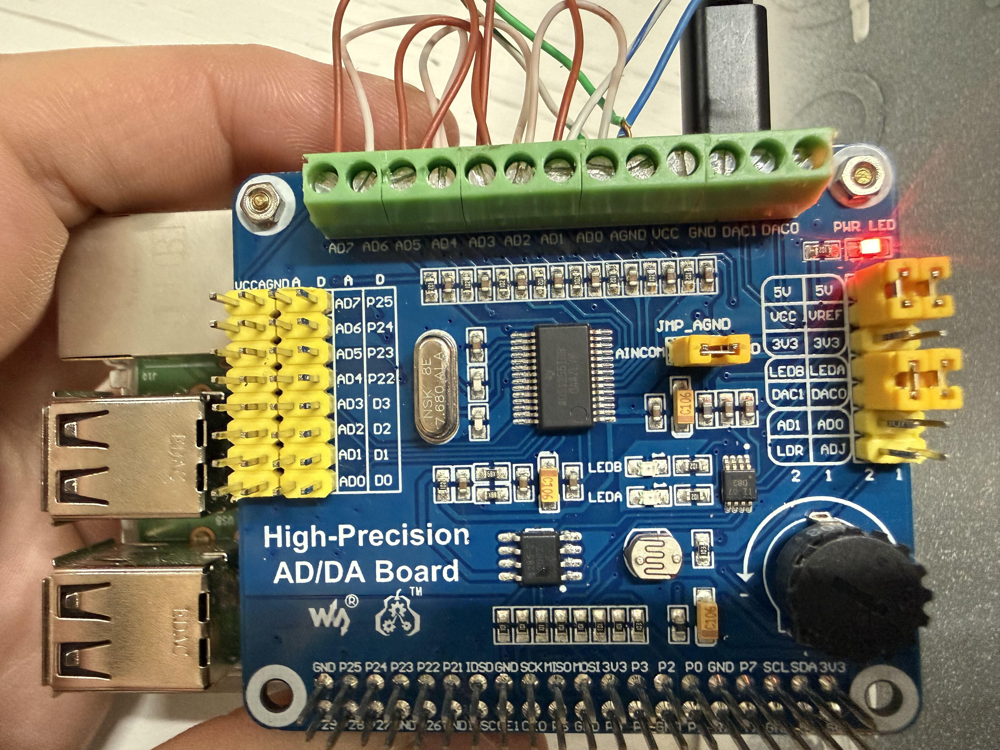
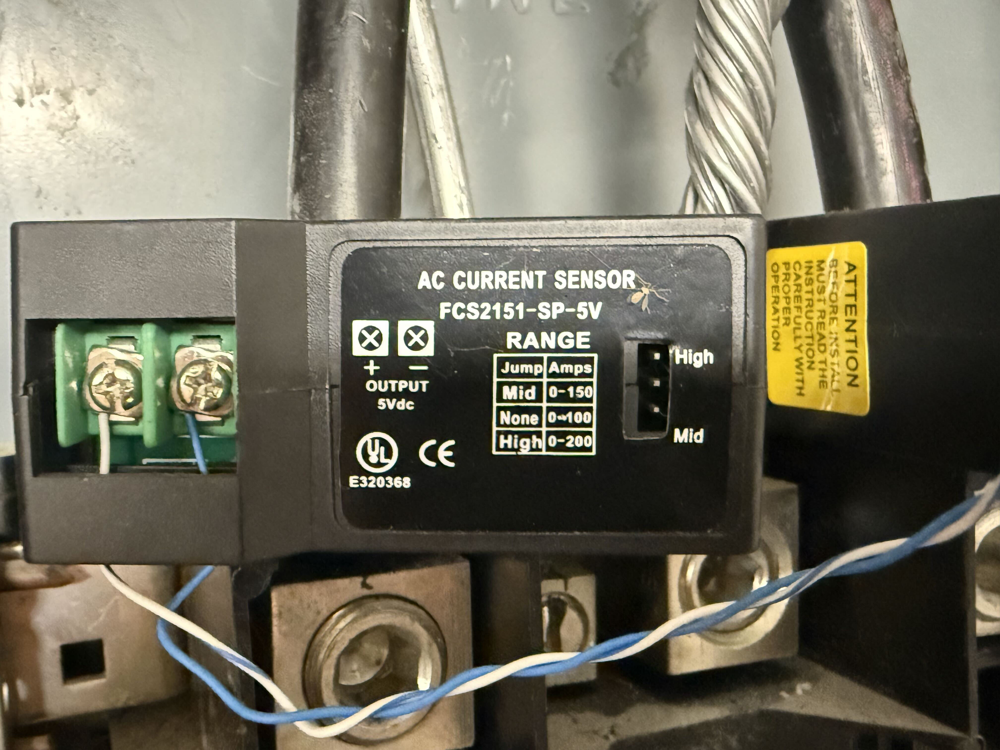
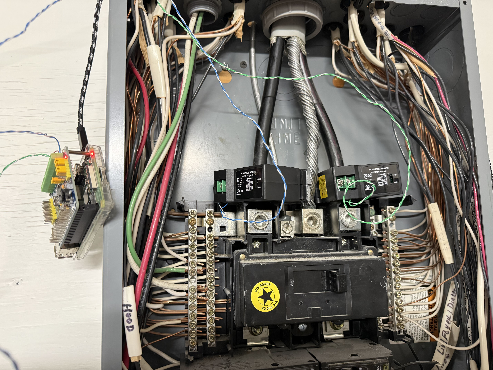
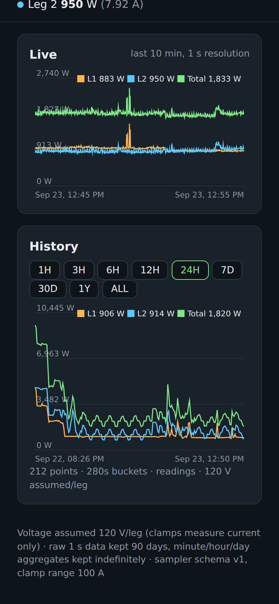

# house_power_dashboard

Realtime + historical power dashboard for a North-American split-phase home
(2 × 120 V legs). Two split-core CT clamps on the mains feeders are read once
per second by a 24-bit ADC on a Raspberry Pi, stored with 90 days of full
resolution plus indefinite downsampled aggregates, and served on a
dependency-free web page with live and history charts.



## How it works

```
CT leg1 (4x fanned) ─┐
                      ├─► ADS1256 (SPI) ─► pi-sampler ──MQTT──┐
CT leg2 (4x fanned) ─┘                          └─HTTP fallback─┐
                                                                ▼
                                         backend (FastAPI, same Pi)
                                           ├─► PostgreSQL (raw 90 d, rollups forever)
                                           ├─► SSE live stream ─► dashboard (static page)
                                           └─► NILM module (optional, feature-flagged)
```

The Pi does sampling, storage, API, and dashboard all-in-one (no Docker or
Node on the Pi — mosquitto + PostgreSQL come from apt, the backend runs in a
venv, the dashboard is static files). The backend's DB layer also supports
TimescaleDB (continuous aggregates) if the project ever moves off-Pi; on the
Pi it uses plain-PostgreSQL rollup tables with identical names and shapes.

## Hardware

**Pi + ADC shield.** Raspberry Pi 3 with a Waveshare High-Precision AD/DA
shield (ADS1256 24-bit ADC over SPI) stacked on top. Each CT output is fanned
out to 4 ADC channels; the sampler takes the median per group so a single bad
conversion can never move a reading. VCC/VREF jumpers are set to 5 V.



**CT clamps.** Two Loulensy/Furison `FCS2151-SP-5V` split-core transducers, one
per mains leg. Native `0–5 V DC analog` output (self-powered, 1% FS,
average-responding), two screw terminals, on-device calibration pots. **Not**
SCT-013s — no burden-resistor or DC-bias circuitry. The range jumper is blank,
which the label confirms is the `0–100 A` range:



**Panel install.** Both clamps around the two main feeders, Pi mounted beside
the panel:



## Dashboard

Dependency-free static page (no framework, no build step): big live total,
per-leg watts/amps, a 10-minute live chart preloaded from storage on every
page load, and a history chart with 1H → ALL ranges. History queries send the
chart's pixel width and the server returns one aggregate bucket per pixel, so
a year view ships ~1k points instead of ~20k.



## Data

**Sampler schema (versioned, v1)** — extensible without breaking ingest:

```json
{"v": 1, "ts": 1727123456.123, "leg1_A": 12.34, "leg2_A": 11.02,
 "range_setting": 100, "host": "adcpi1"}
```

- `amps = volts / 5 × range_setting`; power is computed downstream as
  `W = 120 × I` per leg, `total = V1·I1 + V2·I2` (never single-leg 240 V).
- Voltage is assumed (clamps measure current only); a `CALIBRATION`
  multiplier in the sampler env trims absolute scale once measured against a
  known load.

**Retention:** raw 1 s readings 90 days, then dropped; minute/hour/day
aggregates kept indefinitely (timer-refreshed rollup tables on the Pi;
continuous aggregates if ever moved to TimescaleDB).

**Validated end to end:** a 900 W coffee maker (@124 V mains = 7.3 A) reads
7.1 A on exactly one leg with 1-second step edges; relatch dropouts and
appliance steps are all visible in history.

## Layout

| Path | Description |
|---|---|
| `pi-sampler/` | Minimal Pi loop: ADS1256 → amps → MQTT (+HTTP fallback). Vendored Waveshare driver, systemd unit, mocked unit tests. |
| `pi-hosted/` | All-on-Pi installer: mosquitto + PostgreSQL + backend + rollup timer. No Docker/Node. |
| `backend/` | FastAPI ingest, history (pixel-bucketed), SSE stream, serves `dashboard/`. pytest suite. |
| `dashboard/` | Static HTML/CSS/vanilla-JS page, canvas charts. |
| `nilm/` | Exploratory power-signature event detector. `ENABLE_NILM=false` by default, never in the critical path. |
| `pics/` | Hardware and dashboard photos used above. |

## Quick start

All-on-Pi deploy (sampler, broker, DB, backend, dashboard on `adcpi1` —
see `pi-hosted/`):

```bash
cd pi-hosted
SAMPLER_HOST=pi@192.168.1.28 ./install.sh launch   # copy files, start slow stages
SAMPLER_HOST=pi@192.168.1.28 ./install.sh status   # poll apt/venv progress
SAMPLER_HOST=pi@192.168.1.28 ./install.sh finish   # units on, legacy off, start
# dashboard → http://192.168.1.28:8000/ (from your LAN)
```

`RANGE_AMPS` in the sampler env **must** match the physical clamp jumpers.
Verify against a known load before trusting calibration.

## Security notes

- No secrets in git. Pi/DB passwords live in env files only
  (`sampler.env`, `backend.env`, `.env`) — all gitignored.
- MQTT allows anonymous clients on the LAN (MVP); never expose port 1883 to
  the internet.
